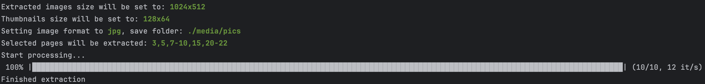

# pdfjuicer



A fast and flexible command-line tool for extracting pages from PDF documents as high-quality images. This utility allows you to quickly convert PDF content into various image formats with extensive customization options.

✅ Extract specific pages or page ranges

✅ Control output image format and quality

✅ Scale images to desired dimensions

✅ Generate thumbnails for quick previews and web use

✅ Asynchronous processing for faster extraction

Built with Go, app leverages the speed of a compiled language and concurrent processing via goroutines.


## About
Pdfjuicer was designed with content creators and educators in mind, providing easy ways to extract visual content from PDF documents for presentations, course materials, and digital content creation.

Whether you're creating educational materials, preparing digital content, or need to quickly extract visuals from documentation, **Pdfjuicer** provides a straightforward command-line interface to transform your PDFs into usable image assets.

## Example use cases

### Content Creation for Digital Platforms

- **Social Media** - Transform PDF visuals into shareable graphics
- **E-learning platforms** - Convert PDF content into image assets for online courses
- **Infographic creation** - Pull charts and diagrams as starting points for custom infographics
- **Telegram Channels** - Create image-based content for Telegram groups and channels
- **Blog illustrations** - Extract relevant images from research papers or reports

The built-in thumbnail generation feature creates perfect preview images for content libraries, ensuring students and followers can quickly identify relevant materials before clicking through to full-size content.

### AI and Automation Integration
The command-line interface makes PDF Pages Extractor an ideal component in automated workflows:

- **OCR Processing Pipelines** - Extract PDF pages as images that can be fed directly into text recognition engines for data extraction
- **n8n Workflow Integration** - Seamlessly incorporate into n8n automation workflows with simple command execution nodes
- **Batch Processing Systems** - Schedule regular extraction jobs for new documents in content management systems

The tool's CLI nature enables headless operation in server environments, making it easy to integrate with AI processing pipelines where PDFs need to be converted to image format before analysis, classification, or text extraction.

### Professional Applications
- **Creating presentations** - Extract diagrams and illustrations for presentations
- **Documentation** - Create visual guides from technical manuals
- **Portfolio creation** - Showcase design work originally saved in PDF format

## Commands
Specify source file and output folder
  ```
  -s, --source string    Specify path to source file (pdf)
  -o, --output string    Specify output folder path
  -x, --postfix string   Postfix for a filename
  -p, --prefix string    Prefix for a filename (default "page")
  ```

Specify particular pages or ranges for extraction
  ```
  -P, --pages string     Use this flag to extract specific pages, 
                         example: 2,3,6-8,10
  ```

Extracted images settings
  ```
  -C, --scale float      Specify image scaling down factor, 
                         example 5, for example 5 means output image will be 
                         5 times smaller than original image (default 1)
  -S, --size string      Specify image size, example 640x480, 
                         if not specified will output default size from document
 -F, --format string    Specify output image format (png/jpg) (default "png")
 ```

Thumbnails settings
 ```
  -t, --thumb            enable thumbnails generation
  -c, --tscale float     Specify thumbnails scaling down factor, 
                         for example 5 means thumbnail will be 5 times smaller 
                         than original image (default 10)
  -z, --tsize string     Specify thumbnails size e.g. 64x64
  ```

Miscellaneous
  ```
  -v, --version          Show version
  -q, --quiet            Quiet mode (no progress bar, no colored output)
  -w, --workers int      Set number of anynchronous workers (default N*)
  ```

*Default number of asynchronous workers is set by default to number (N) of logical CPU cores in your computer.

## Installation

Currently 2 options are available:
* For macOS on Apple Silicon (M-series), pre-compiled binary is available in the **Releases** section
* Build from source (Go v1.23+ required)

### Build from source
```bash
# clone repository
git clone https://github.com/dmikhr/pdfjuicer.git

# go to source directory and create directory for binary
cd pdfjuicer && mkdir bin

# Download all dependencies defined in go.mod
go mod download

# build binary
go build -o ./bin/pdfjuicer ./cmd

#run binary
./bin/pdfjuicer
```

In order to be able to call app from terminal simply by typing its name like in *Usage examples* section you can check the following article: [How to Add a Binary (or Executable, or Program) to Your PATH on macOS, Linux, or Windows](https://zwbetz.com/how-to-add-a-binary-to-your-path-on-macos-linux-windows/)

## Usage examples

See help by calling app either without parameters
```
pdfjuicer
```
or call app with flag `--help` or `-h`

Extract all pages from pdf document as images using default settings (original image size):

```sh
pdfjuicer -s ./tmp/test.pdf -o ./media/pics
```

Extract in quite mode. No progress bar and output formatting. More convenient if app is called from another program.
```sh
pdfjuicer -s ./tmp/test.pdf -o ./media/pics --quiet
```

Extract pages 1 to 3 from `./tmp/test.pdf` and save images `./media/pics` reduce size by a factor of 5
```sh
pdfjuicer -s ./tmp/test.pdf -o ./media/pics --pages=1-3 --scale=5
```

Extract pages `-P` 2-5 from pdf document as images using default settings with thumbnails `-t` using shorthand flags:
```sh
pdfjuicer -s ./tmp/test.pdf -o ./media/pics -t -P=2-5
```

Extract pages 3,5,7-10,15,20-22 in jpg format with specific image and thumbnails sizes
```sh
pdfjuicer -s ./tmp/test.pdf -o ./media/pics -t --pages=3,5,7-10,15,20-22 --size=512x256 --tsize=128x64 --format=jpg
```
