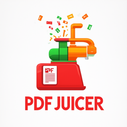

# pdfjuicer



✅

✅

✅

## Use cases

## Commands

## Usage examples

Extract all pages from pdf document as images using default settings (original image size):

```sh
pdfjuicer -s ./tmp/test.pdf -o ./media/pics
```

Extract in quite mode. No progress bar and output formatting. More convenient if app is called from another program.
```sh
pdfjuicer -s ./tmp/test.pdf -o ./media/pics --quiet
```

Extract pages 1 to 3 from `./tmp/test.pdf` and save images `./media/pics` reduce size by a factor of 5
```sh
pdfjuicer -s ./tmp/test.pdf -o ./media/pics --pages=1-3 --scale=5
```

Extract pages `-P` 2-5 from pdf document as images using default settings with thumbnails `-t` using shorthand flags`:
```sh
pdfjuicer -s ./tmp/test.pdf -o ./media/pics -t -P=2-5
```

Extract pages 3,5,7-10,15,20-22 in jpg format with specific image and thumbnails sizes
```sh

```


